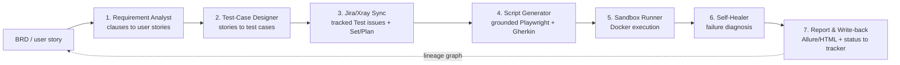

# Sutra

**Turn a requirements document into tracked test cases and self-grounded, executed browser automation — with full traceability from every result back to the requirement that produced it.**

Sutra is a 7-stage TypeScript pipeline. You give it a BRD or a user story; it writes the user stories and test cases, files them in a test-management tool (Xray on Jira, or Kiwi TCMS), writes Playwright + Gherkin automation *grounded in the real application*, runs it in a Docker sandbox, diagnoses failures, and writes results back — recording a lineage graph the whole way.

> Think of it as a **robot QA engineer**: hand it requirements, get back tracked, running, self-diagnosing tests — and a paper trail proving each test traces to a requirement.

---

## The pipeline



Every artifact — story, test case, ticket, script, run, result — is a node in a **lineage graph**, linked parent→child, so any result can be traced back to its originating requirement sentence.

---

## Why it's more than "AI writes tests"

| Property | What it means |
|---|---|
| **Grounded, not hallucinated** | Before writing a test, it opens the *real* app via Playwright MCP and reads the actual page — so tests are based on what's genuinely there, not what an AI imagined. |
| **Idempotent** | Each requirement clause is content-hashed. Re-running the same input produces **zero** duplicate tickets or files; editing one clause regenerates only that clause. Verified: a second identical run created 0 new tickets/files in ~37s. |
| **Never destructive** | On a change, old artifacts are marked superseded/stale and unlisted — **never deleted**. Full version history. |
| **Traceable** | The lineage graph gives requirement-to-result traceability automatically — audit-grade. |
| **Backend-agnostic** | Test-management sits behind one interface (`XraySyncPort`). Xray, Kiwi TCMS, or a credential-free stub — switching is one env var, zero downstream code change. |
| **Grounding-safe** | If a feature isn't built/reachable, the test is marked **BLOCKED** — never a fabricated pass. |
| **Reproducible** | Tests run in a sealed Docker sandbox; a pass is a real pass anywhere. |

---

## Quick start

**Prerequisites:** Node ≥ 20, Docker Desktop running, and either a Claude Code login or an `ANTHROPIC_API_KEY`.

```bash
npm install
cp .env.example .env          # optional; stub mode works with defaults
npm run typecheck && npm test  # sanity check (29 unit tests)

# Run the pipeline in stub mode (no tracker credentials needed):
npm run pipeline -- --brd ./samples/sample-brd.md
```

Outputs land in `generated/` (stories, test cases, scripts, lineage graph) and `test-results/summary.md`. Run it again to watch idempotency in action — every clause logs `cache hit`.

See **[docs/USAGE-RUNBOOK.md](docs/USAGE-RUNBOOK.md)** for step-by-step usage and result validation.

---

## Test-management backends

Selected by `TCMS_BACKEND` in `.env`. If a backend's credentials are incomplete, the pipeline safely falls back to stub — it never runs half-authenticated.

| Backend | `TCMS_BACKEND` | Needs | Notes |
|---|---|---|---|
| **Stub** | `stub` (default) | nothing | Fabricates + records the tracker side locally. |
| **Kiwi TCMS** | `kiwi` | local Kiwi + `KIWI_*` | Free, self-hosted. See **[docs/kiwi-setup.md](docs/kiwi-setup.md)**. |
| **Xray / Jira** | `xray` | `JIRA_*` + `XRAY_*` | Xray Cloud on Jira. |

Spin up a local Kiwi:
```bash
docker compose -f docker/kiwi/docker-compose.yml up -d
docker exec -it kiwi_web /Kiwi/manage.py initial_setup
```

---

## Project structure

```
src/
  orchestrator/     CLI entry, the pipeline flow, the concurrent-run lock
  lineage/          the traceability graph (types, build/query, persistence)
  stages/01…07/     the seven pipeline stages
  sdk/              schema-validated Claude Agent SDK wrapper
  utils/            logger, hashing/safe-writes, prompt loading
config/             env + backend resolution; Playwright-MCP config
prompts/            per-stage AI instructions
docker/             sandbox image + local Kiwi stack
docs/               guides (see below)
```

Full walkthrough: **[docs/CODEBASE-GUIDE.md](docs/CODEBASE-GUIDE.md)**.

---

## Documentation

| Doc | For |
|---|---|
| [CODEBASE-GUIDE.md](docs/CODEBASE-GUIDE.md) | File-by-file / logic-by-logic technical deep dive |
| [USAGE-RUNBOOK.md](docs/USAGE-RUNBOOK.md) | How to run and validate results (stub / Kiwi / Xray) |
| [PROJECT-EXPLAINER.md](docs/PROJECT-EXPLAINER.md) | Non-technical explanation for any audience |
| [kiwi-setup.md](docs/kiwi-setup.md) | Kiwi TCMS setup + data-model mapping |

---

## Testing

- `npm test` — unit tests over the deterministic core (clause splitting, lineage graph, failure classification, config resolution, key namespacing).
- Live integration is verified against real Kiwi/Docker instances; the AI stages are verified end-to-end.

---

## Status & roadmap

A working pipeline, verified end-to-end in stub and Kiwi modes. Known next steps:

- Live Xray write-back verification against a real Jira tenant (code complete, unverified).
- Jira-as-input source so a BA works entirely in Jira (no new UI needed).
- Bounded auto-repair for UI *drift* in the self-healer (today it diagnoses only).
- An optional observability dashboard (runs, statuses, the lineage graph).

---

## Tech

TypeScript · Node ≥ 20 · Claude (Anthropic Agent SDK) · Playwright + Cucumber/Gherkin · Playwright MCP (grounding) · Docker (sandbox) · Xray/Jira (GraphQL + REST) · Kiwi TCMS (JSON-RPC) · Zod · Vitest.
